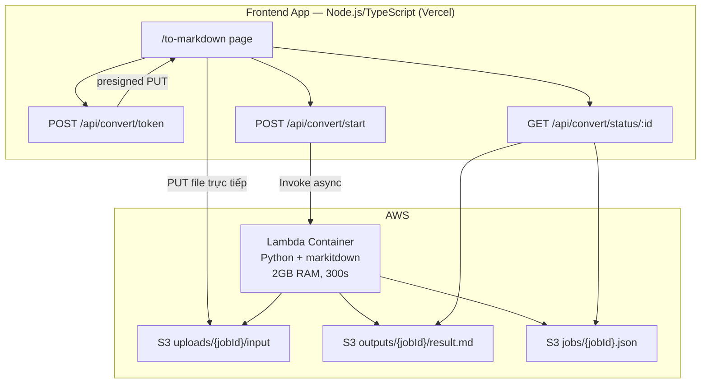
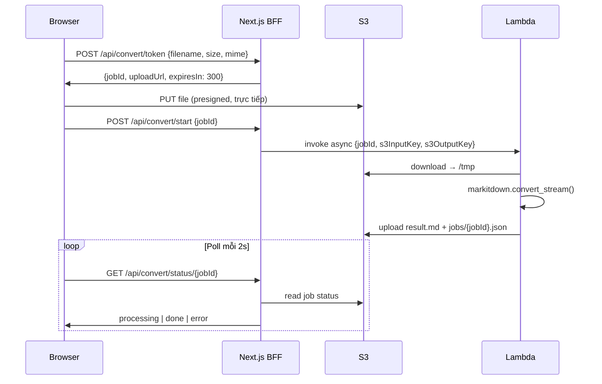

# MarkItDown Webservice — Lambda + S3

> Plan triển khai service convert PDF/office → Markdown dùng [microsoft/markitdown](https://github.com/microsoft/markitdown).  
> Quy mô: cá nhân / team nhỏ (~ vài chục file/ngày). Chi phí mục tiêu: **$0/tháng** (AWS free tier).

---

## Tóm tắt quyết định

| Hạng mục | Quyết định |
|----------|------------|
| **Backend convert** | AWS Lambda (Python container) + markitdown |
| **Storage** | S3 (presigned upload, file lớn) |
| **API / UI** | Node.js / TypeScript (Next.js trên Vercel) |
| **Ngôn ngữ worker** | Python bắt buộc (markitdown không có bản Node) |
| **Ngôn ngữ orchestration** | TypeScript (~70% codebase) |

---

## Kiến trúc



### Luồng xử lý



**Tại sao upload thẳng S3?**

- Vercel body limit ~4.5MB — file không đi qua Vercel
- Lambda sync payload limit 6MB — S3 bypass hoàn toàn
- Hỗ trợ file tới **100MB**

**Tại sao không API Gateway?**

- API Gateway timeout **cố định 29 giây** — PDF convert thường 30–90s → 504
- BFF invoke Lambda qua **AWS SDK** (`InvocationType: 'Event'`)

---

## Phân tách Node.js vs Python

| Layer | Ngôn ngữ | Trách nhiệm |
|-------|----------|-------------|
| UI + BFF API | **TypeScript** | Presigned S3, invoke Lambda, job status, rate limit, HMAC token |
| Convert worker | **Python** | markitdown `convert_stream()` |
| Infra | AWS SAM / Terraform | S3, ECR, Lambda, IAM |

**Không nên** viết 100% Node.js thay markitdown (`pdf-parse`, `mammoth`…) — mất "everything to MD", chất lượng kém, nhiều lib rời.

**Không nên** Node Lambda spawn Python subprocess — image nặng, anti-pattern.

---

## API (Next.js Route Handlers)

### `POST /api/convert/token`

Tạo job + presigned URL upload.

```typescript
// Request
{ filename: string; size: number; mime: string }

// Response
{ jobId: string; uploadUrl: string; expiresIn: 300 }
```

Validation: `size ≤ 100MB`, extension whitelist (`.pdf`, `.docx`, `.pptx`, `.xlsx`, `.html`, `.csv`, `.json`, …).

### `POST /api/convert/start`

Sau khi client upload xong lên S3.

```typescript
// Request
{ jobId: string }

// Response
{ status: "processing" }

// Side effect: Lambda.invoke({ jobId, s3InputKey, s3OutputKey })
```

### `GET /api/convert/status/:jobId`

Poll mỗi ~2 giây.

```typescript
// processing
{ status: "processing" }

// done — inline nếu nhỏ, presigned GET nếu >1MB
{ status: "done"; markdown?: string; downloadUrl?: string }

// error
{ status: "error"; message: string }
```

Job metadata: `s3://{bucket}/jobs/{jobId}.json` — không cần DynamoDB ở quy mô cá nhân.

---

## Python Lambda worker

### Handler (tối thiểu)

```python
# infra/lambda/lambda_handler.py
import json
import os
import boto3
from markitdown import MarkItDown

s3 = boto3.client("s3")
md = MarkItDown(enable_plugins=False)

def handler(event, context):
    job_id = event["jobId"]
    bucket = event["bucket"]
    input_key = event["s3InputKey"]
    output_key = event["s3OutputKey"]
    job_key = f"jobs/{job_id}.json"

    def update_status(status, **extra):
        s3.put_object(
            Bucket=bucket,
            Key=job_key,
            Body=json.dumps({"status": status, **extra}),
            ContentType="application/json",
        )

    try:
        update_status("processing")
        local_in = f"/tmp/{job_id}-input"
        local_out = f"/tmp/{job_id}-output.md"

        s3.download_file(bucket, input_key, local_in)
        with open(local_in, "rb") as f:
            f.name = os.path.basename(input_key)
            result = md.convert_stream(f)

        with open(local_out, "w", encoding="utf-8") as f:
            f.write(result.text_content)

        s3.upload_file(local_out, bucket, output_key)
        update_status("done", outputKey=output_key)
        return {"status": "done"}

    except Exception as e:
        update_status("error", message=str(e))
        raise
```

### Dockerfile

```dockerfile
FROM public.ecr.aws/lambda/python:3.12
RUN pip install 'markitdown[pdf,docx,pptx,xlsx]' boto3 --no-cache-dir
COPY lambda_handler.py ${LAMBDA_TASK_ROOT}
CMD ["lambda_handler.handler"]
```

### Cấu hình Lambda

| Setting | Giá trị |
|---------|---------|
| Memory | **2048 MB** |
| Timeout | **300 s** |
| Ephemeral `/tmp` | **2048 MB** |
| Invocation | **async** (`Event`) |
| Package | **Container image** (ECR) — không dùng zip (Magika ~140MB) |

---

## Cấu trúc repo đề xuất

```
├── src/                          # Next.js app
│   ├── app/
│   │   ├── to-markdown/
│   │   │   ├── page.tsx          # UI: drop zone, progress, result
│   │   │   └── layout.tsx
│   │   └── api/convert/
│   │       ├── token/route.ts
│   │       ├── start/route.ts
│   │       └── status/[jobId]/route.ts
│   └── lib/convert/
│       ├── s3.ts                 # presigned URL
│       ├── lambda.ts             # invoke worker
│       ├── jobs.ts               # read/write job JSON on S3
│       ├── tokens.ts             # HMAC signed token
│       └── limits.ts             # size, extension, rate limit
│
└── infra/
    ├── template.yaml             # AWS SAM
    ├── lambda/
    │   ├── Dockerfile
    │   └── lambda_handler.py
    └── README-deploy.md
```

### Dependencies (package.json)

```json
{
  "@aws-sdk/client-s3": "^3.x",
  "@aws-sdk/client-lambda": "^3.x",
  "@aws-sdk/s3-request-presigner": "^3.x"
}
```

### Environment variables (Vercel)

```env
AWS_REGION=ap-southeast-1
AWS_ACCESS_KEY_ID=...
AWS_SECRET_ACCESS_KEY=...
CONVERT_S3_BUCKET=your-bucket-name
CONVERT_TOKEN_SECRET=...          # HMAC secret, 32+ bytes random
LAMBDA_CONVERT_FUNCTION=markitdown-worker
```

---

## AWS Infrastructure (SAM)

| Resource | Mô tả |
|----------|--------|
| **S3 bucket** | Private; lifecycle xóa `uploads/`, `outputs/` sau 24h |
| **ECR repo** | Chứa Lambda container image |
| **Lambda function** | Container image, 2048MB, 300s |
| **IAM user/role (Vercel)** | `s3:PutObject`, `s3:GetObject` (presign), `lambda:InvokeFunction` |
| **IAM role (Lambda)** | `s3:GetObject`, `s3:PutObject` trên bucket |

**Budget alert:** tạo budget $1/tháng trên AWS Billing.

---

## Giới hạn & hiệu suất

| Tham số | Giá trị |
|---------|---------|
| Max file upload | **100 MB** |
| Formats | pdf, docx, pptx, xlsx, html, csv, json, txt, … |
| Rate limit | **20 job/giờ/IP** |
| Presigned URL TTL | **5 phút** |
| S3 lifecycle | Xóa file sau **24 giờ** |
| Lambda cold start | **5–15 giây** — hiển thị UX "Đang khởi động…" |
| Poll interval | **2 giây** |

---

## Bảo mật

### Nguyên tắc

- Browser **không** nhận AWS credentials
- S3 bucket **private** — chỉ truy cập qua presigned URL
- Lambda **không** nhận URL/path tùy ý — chỉ S3 key từ event đã validate
- Same-origin/CORS **không** chặn `curl` spam BFF — cần rate limit + HMAC token

### Lớp bảo vệ BFF

1. **HMAC signed token** — verify trước khi invoke Lambda
2. **Rate limit theo IP** — 20 job/giờ
3. **Extension + size whitelist**
4. **Presigned URL TTL** — 5 phút

---

## Chi phí

**markitdown built-in:** $0/conversion

**AWS (~30 file/ngày, 10MB, 60s, 2GB):**

```
900 req/tháng × 60 GB-s = 54,000 GB-s → trong free tier 400,000 GB-s
S3 transient ~9GB/tháng → ~$0.02/tháng
Tổng: ~$0/tháng
```

---

## Roadmap triển khai

| Bước | Nội dung | Thời gian |
|------|----------|-----------|
| 1 | AWS infra: S3, ECR, Lambda, IAM | 0.5 ngày |
| 2 | Node.js BFF: `/token`, `/start`, `/status` | 1 ngày |
| 3 | Security: HMAC, rate limit, bucket policy | 0.5 ngày |
| 4 | UI `/to-markdown` | 1 ngày |
| 5 | Polish: errors, cold start UX, local dev | 0.5 ngày |

---

## Checklist production

```
[ ] S3 bucket private + lifecycle 24h
[ ] Lambda container trên ECR (không zip)
[ ] Không dùng API Gateway cho convert
[ ] AWS budget alert $1/tháng
[ ] Vercel env secrets configured
[ ] Rate limit + HMAC token trên BFF
[ ] Test: PDF, DOCX, PPTX, file 10MB, file corrupt
[ ] Privacy policy updated
```

---

## Tài liệu tham khảo

- [markitdown GitHub](https://github.com/microsoft/markitdown)
- [markitdown#1234 — Lambda / Magika size](https://github.com/microsoft/markitdown/issues/1234)
- [AWS Lambda container images](https://docs.aws.amazon.com/lambda/latest/dg/images-create.html)

---

*Plan tinh chỉnh — Lambda + S3 + Node.js/TypeScript + Python worker. 2026-06-06.*
